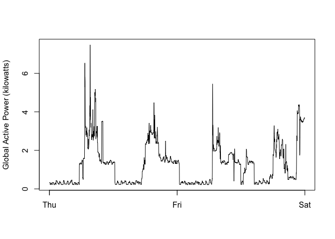

### Loading the data
When loading the dataset into R, please consider the following:

* The dataset has 2,075,259 rows and 9 columns. First calculate a rough estimate of how much memory the dataset will require in memory before reading into R. Make sure your computer has enough memory (most modern computers should be fine).

* We will only be using data from the dates 2007-02-01 and 2007-02-02. One alternative is to read the data from just those dates rather than reading in the entire dataset and subsetting to those dates.

* You may find it useful to convert the Date and Time variables to Date/Time classes in R using the `strptime()` and `as.Date()` functions.

* Note that in this dataset missing values are coded as `?`.


```r
# Download and save zip file
url <- "https://d396qusza40orc.cloudfront.net/exdata%2Fdata%2Fhousehold_power_consumption.zip"
download.file(url,destfile="./hpc.zip",method="curl")
# unzip the file
zipfile <- "hpc.zip"
unzip(zipfile,exdir=".")
# read useful data into R, i.e. data from dates 2007-02-01 and 2007-02-02
lines <- readLines("household_power_consumption.txt")
piece <- grep("^[1,2]/2/2007",lines)
pieceData <- read.table("household_power_consumption.txt",skip=piece[1]-1,nrow=length(piece)-1,header=F,na.strings="?",sep=";")
colnames(pieceData) <- c("Date","Time","Global_active_power","Global_reactive_power","Voltage","Global_intensity","Sub_metering_1","Sub_metering_2","Sub_metering_3")
```

### Making plots

Our overall goal here is simply to examine how household energy usage varies over a 2-day period in February, 2007. Your task is to reconstruct the following plots below, all of which were constructed using the base plotting system.

For each plot you should

* Construct the plot and save it to a PNG file with a width of 480 pixels and a height of 480 pixels.

* Name each of the plot files as plot1.png, plot2.png, etc.

* Create a separate R code file (plot1.R, plot2.R, etc.) that constructs the corresponding plot, i.e. code in plot1.R constructs the plot1.png plot. Your code file should include code for reading the data so that the plot can be fully reproduced. You should also include the code that creates the PNG file.


```r
# make plot1
with(pieceData,hist(Global_active_power,xlab="Global Active Power (kilowatts)",main="Global Active Power",col="red"))
```

<!-- -->

```r
# change Date and Time format
dates <- as.Date(pieceData$Date,format="%d/%m/%Y")
```

```
## Warning in strptime(x, format, tz = "GMT"): unknown timezone 'zone/tz/
## 2017c.1.0/zoneinfo/America/New_York'
```

```r
datestimes <- paste(dates,pieceData$Time)
DsTs <- strptime(datestimes,"%Y-%m-%d %H:%M:%S")
# make plot2
plot(DsTs,pieceData$Global_active_power,xlab="",ylab="Global Active Power (kilowatts)",type="l")
```

<!-- -->

```r
# make plot3
plot(DsTs,pieceData$Sub_metering_1,xlab="",ylab="Energy sub metering",type="l")
lines(DsTs,pieceData$Sub_metering_2,col="red")
lines(DsTs,pieceData$Sub_metering_3,col="blue")
legend("topright",col=c("black","red","blue"),legend=c("sub_metering_1","Sub_metering_2","Sub_metering_3"),lwd=1)
```

<!-- -->

```r
# make plot4
par(mfrow=c(2,2))
plot(DsTs,pieceData$Global_active_power,xlab="",ylab="Global Active Power",type="l")
plot(DsTs,pieceData$Voltage,xlab="datetime",ylab="Voltage",type="l")
plot(DsTs,pieceData$Sub_metering_1,xlab="",ylab="Energy sub metering",type="l")
lines(DsTs,pieceData$Sub_metering_2,col="red")
lines(DsTs,pieceData$Sub_metering_3,col="blue")
legend("topright",col=c("black","red","blue"),legend=c("sub_metering_1","Sub_metering_2","Sub_metering_3"),lwd=1,bty="n",cex=0.7)
plot(DsTs,pieceData$Global_reactive_power,xlab="datetime",ylab="Global_reactive_power",type="l")
```

<!-- -->
